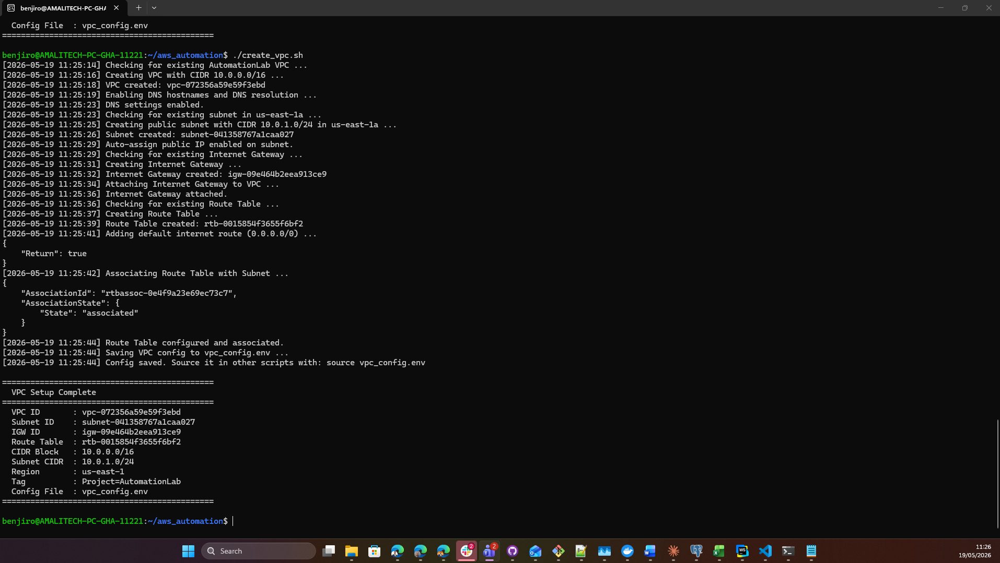

# AutomationLab — AWS CLI Bash Automation Scripts

A set of Bash scripts that automate the provisioning and cleanup of AWS resources (EC2, Security Groups, S3) using the AWS CLI.

---

## Prerequisites

Before running any script, ensure the following are in place:

1. **AWS CLI v2** installed on your machine
   ```bash
   aws --version
   ```

2. **AWS credentials configured** via `aws configure`
   ```bash
   aws configure
   # Provide: Access Key ID, Secret Access Key, Region (us-east-1), Output format (json)
   ```

3. **Verify your credentials and region**
   ```bash
   aws sts get-caller-identity
   aws configure list
   ```

4. **Make scripts executable**
   ```bash
   chmod +x create_ec2.sh create_security_group.sh create_s3_bucket.sh cleanup_resources.sh
   ```

---

## Scripts

### 1. `create_vpc.sh` — Create a VPC

Creates a fully configured VPC with a public subnet, internet gateway, and route table — everything needed for EC2 instances to be publicly reachable. Run this **first** before any other script.

**Usage:**
```bash
./create_vpc.sh
```

**What it does:**
- Creates a VPC with CIDR `10.0.0.0/16`
- Creates a public subnet with CIDR `10.0.1.0/24` in `us-east-1a` with auto-assign public IP enabled
- Creates and attaches an Internet Gateway to the VPC
- Creates a Route Table with a default `0.0.0.0/0` route through the IGW
- Enables DNS hostnames and DNS resolution on the VPC
- Tags all resources with `Project=AutomationLab`
- Saves VPC and Subnet IDs to `vpc_config.env` for use by other scripts

**Sample output:**
```
=============================================
  VPC Setup Complete
=============================================
  VPC ID       : vpc-0abc12345678
  Subnet ID    : subnet-0abc12345678
  IGW ID       : igw-0abc12345678
  Route Table  : rtb-0abc12345678
  CIDR Block   : 10.0.0.0/16
  Subnet CIDR  : 10.0.1.0/24
  Region       : us-east-1
  Tag          : Project=AutomationLab
  Config File  : vpc_config.env
=============================================
```


---

### 2. `create_ec2.sh` — Launch an EC2 Instance

Creates a new EC2 key pair and launches a free-tier Amazon Linux 2 instance tagged with `Project=AutomationLab`.

**Usage:**
```bash
./create_ec2.sh
```

**What it does:**
- Automatically sources `vpc_config.env` (created by `create_vpc.sh`) to launch into the correct subnet
- Dynamically fetches the latest Amazon Linux 2 AMI for `us-east-1`
- Creates a key pair (`automation-lab-key`) and saves it as `automation-lab-key.pem`
- Launches a `t3.micro` instance (free-tier eligible in `us-east-1`)
- Tags the instance with `Project=AutomationLab` and `Name=AutomationLab-EC2`
- Waits for the instance to reach the `running` state
- Prints the Instance ID and Public IP

**Sample output:**
```
=============================================
  EC2 Instance Created Successfully
=============================================
  Instance ID : i-0abc123def456789
  Public IP   : 13.48.x.x
  AMI ID      : ami-xxxxxxxxxxxxxxxxx
  Key File    : automation-lab-key.pem
  Region      : us-east-1
  Tag         : Project=AutomationLab
=============================================
```

---

### 3. `create_security_group.sh` — Create a Security Group

Creates a security group (`devops-sg`) with inbound rules for SSH (port 22) and HTTP (port 80).

**Usage:**
```bash
./create_security_group.sh
```

**What it does:**
- Automatically sources `vpc_config.env` to use the correct VPC (falls back to default VPC if not found)
- Creates security group `devops-sg` with a description
- Opens port 22 (SSH) and port 80 (HTTP) from anywhere (`0.0.0.0/0`)
- Tags the group with `Project=AutomationLab`
- Displays all inbound rules in a table

**Sample output:**
```
=============================================
  Security Group Created Successfully
=============================================
  Group Name  : devops-sg
  Group ID    : sg-0abc123456789
  VPC ID      : vpc-0abc12345678
  Region      : us-east-1
  Tag         : Project=AutomationLab
=============================================
```

---

### 4. `create_s3_bucket.sh` — Create an S3 Bucket

Creates a uniquely named S3 bucket with versioning enabled, a security policy (HTTPS-only), and uploads a sample file.

**Usage:**
```bash
./create_s3_bucket.sh
```

**What it does:**
- Generates a unique bucket name using a timestamp + random suffix
- Creates the bucket in `us-east-1`
- Enables versioning
- Applies a bucket policy that denies non-HTTPS access
- Tags the bucket with `Project=AutomationLab`
- Uploads `welcome.txt` to the bucket

**Sample output:**
```
=============================================
  S3 Bucket Created Successfully
=============================================
  Bucket Name : automation-lab-20240518123045-12345
  Region      : us-east-1
  Versioning  : Enabled
  Tag         : Project=AutomationLab
  Uploaded    : s3://automation-lab-20240518123045-12345/welcome.txt
=============================================
```

---

### 5. `cleanup_resources.sh` — Delete All Resources

Safely removes all resources tagged `Project=AutomationLab` to avoid unwanted AWS charges.

**Usage:**
```bash
./cleanup_resources.sh
```

**What it does:**
- Prompts for confirmation before proceeding
- Terminates all tagged EC2 instances and waits for full termination
- Deletes the `automation-lab-key` key pair and local `.pem` file
- Deletes all tagged security groups
- Empties and deletes all tagged S3 buckets (handles versioned objects and delete markers)
- Detaches and deletes the Internet Gateway
- Deletes all subnets and route tables inside the VPC
- Deletes the VPC itself
- Removes the local `vpc_config.env` file

> **Always run this script after testing** to avoid unexpected AWS charges.

---

## Recommended Execution Order

```bash
# 1. Create the VPC and networking infrastructure
./create_vpc.sh

# 2. Create the security group (uses vpc_config.env automatically)
./create_security_group.sh

# 3. Launch the EC2 instance (uses vpc_config.env automatically)
./create_ec2.sh

# 4. Create the S3 bucket
./create_s3_bucket.sh

# 5. When done — clean everything up
./cleanup_resources.sh
```

---

## How Scripts Share Configuration

After running `create_vpc.sh`, a file called `vpc_config.env` is created in the same directory. It contains the VPC ID and Subnet ID:

```bash
export VPC_ID="vpc-0abc12345678"
export SUBNET_ID="subnet-0abc12345678"
export IGW_ID="igw-0abc12345678"
export REGION="us-east-1"
```

`create_ec2.sh` and `create_security_group.sh` automatically source this file if it exists — no manual edits needed.

---

## Recommended Execution Order

```bash
# 1. Set up security group first (so you can attach it to EC2 if needed)
./create_security_group.sh

# 2. Launch the EC2 instance
./create_ec2.sh

# 3. Create the S3 bucket
./create_s3_bucket.sh

# 4. When done — clean everything up
./cleanup_resources.sh
```

---

## Notes

- All resources are tagged `Project=AutomationLab` so they are easy to identify and safely cleaned up.
- Scripts use `set -euo pipefail` to exit immediately on any error.
- Duplicate resource detection is built in — re-running scripts won't create duplicates.

---
